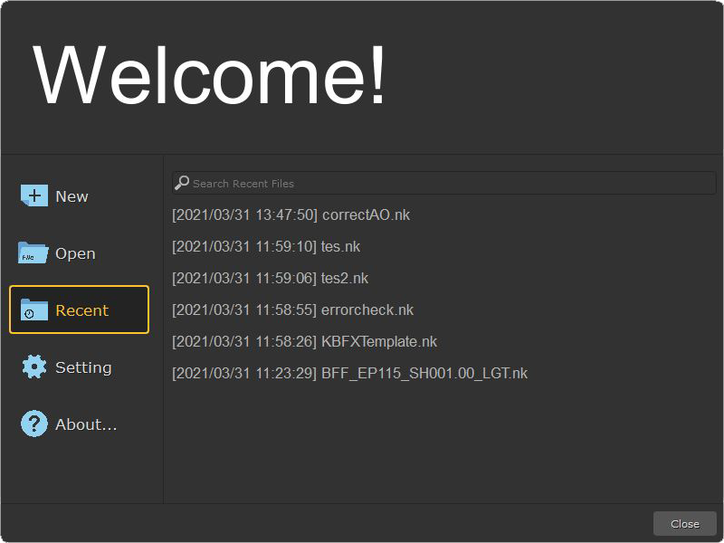

<!--
repo name: welcome-screen
description: An awesome welcome screen for your Digital Content Creation Software
github name:  timothyhalim
link: https://github.com/timothyhalim/welcome-screen
logo path: 
screenshot: preview/WelcomeScreen.png
twitter: your_username
email: mail@timo.ink
-->

<!-- PROJECT LOGO -->
 
<h3 align="center"><a href="https://github.com/timothyhalim/welcome-screen">Welcome Screen</a></h3>
     
    

        
         
        An awesome welcome screen for your Digital Content Creation Software
         
        <a href="https://github.com/timothyhalim/welcome-screen/tree/main/preview">View Demo</a>
        •
        <a href="https://github.com/timothyhalim/welcome-screen/issues">Report Bug</a>
        •
        <a href="https://github.com/timothyhalim/welcome-screen/issues">Request Feature</a>
    

<!-- TABLE OF CONTENTS -->
## Table of Contents

- [Table of Contents](#table-of-contents)
- [About The Project](#about-the-project)
  - [Built With](#built-with)
- [Getting Started](#getting-started)
  - [Prerequisites](#prerequisites)
  - [Installation](#installation)
- [Usage](#usage)
- [Roadmap](#roadmap)
- [Contributing](#contributing)
- [License](#license)
- [Contact](#contact)

<!-- ABOUT THE PROJECT -->
## About The Project

This project is inspired from www.nukepedia.com/python/ui/welcomescreen  
Welcome screen work with other DCC software such as Maya, and Houdini that use QT as base  
Shows list of recently opened files and also build-in File Browser build using QT  

Tested to be Working on:
* Nuke 7-11
* Maya 2017-2018

### Build With
* [PySide2]() or [PySide]()
* [Python]()

<!-- GETTING STARTED -->
## Getting Started

### Prerequisites
* [Git]()
* [Python]()
* [PySide2]() or [PySide]()

### Installation
* Clone Repository
* Install tutorial for each DCC is located on app/{software}/install.txt

<!-- Usage -->
## Usage
After following the install tutorial, you can run Welcome Screen by Pressing Ctrl + Shift + W
For your studio need you might want to change some parameter in <a href="https://github.com/timothyhalim/welcome-screen/blob/main/config.py">config.py</a> 

* Project Name is derived from environment variable using os.environ.get("PROJECTNAME", "Welcome")
* Settings and RecentFiles filepath is also located in config.py

<!-- ROADMAP -->
## Roadmap

See the [open issues](https://github.com/timothyhalim/welcome-screen/issues) for a list of proposed features (and known issues).

<!-- CONTRIBUTING -->
## Contributing

Contributions are what make the open source community such an amazing place to be learn, inspire, and create. Any contributions you make are **greatly appreciated**.

1. Fork the Project
2. Create your Feature Branch (`git checkout -b feature/AmazingFeature`)
3. Commit your Changes (`git commit -m 'Add some AmazingFeature'`)
4. Push to the Branch (`git push origin feature/AmazingFeature`)
5. Open a Pull Request

<!-- LICENSE -->
## License

Released under the GNU General Public License (GPL, or “free software”).

<!-- CONTACT -->
## Contact

<a href="https://timo.ink/">Timo.ink</a> - mail@timo.ink

Project Link: [https://github.com/timothyhalim/welcome-screen](https://github.com/timothyhalim/welcome-screen)

